* # Partitech Sonata Extra Bundle : Features
* 
* ### AsAdmin() php attribute configuration
* 
* - Add another configuration type directly in the Admin class
* - Documentation : [as-admin-attribute.md](./as-admin-attribute.md)
* - Code Preview: 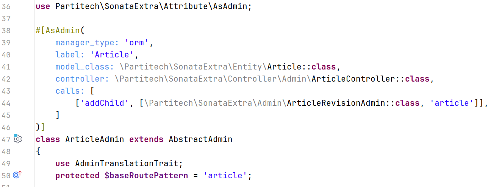
* 
* ### Activity Log in Admin
* The Activity Log feature in the Sonata Extra Bundle is designed to monitor and log all activities within the admin site. It provides a comprehensive view of actions taken, resources involved, descriptions of activities, and the users who performed them.
* 
* - **Action Type Display**: Shows the type of action performed (e.g., create, update, delete).
* - **Resource Tracking**: Identifies the resource that was affected by the action.
* - **Action Description**: Provides a detailed description of the activity.
* - **User Identification**: Displays the user who performed the action.
* - **Detailed View**: Offers an in-depth view of the modified elements in each activity.
* - **Undo Functionality**: Includes a feature to reverse modifications when possible.
* 
* - List view :
* 
* 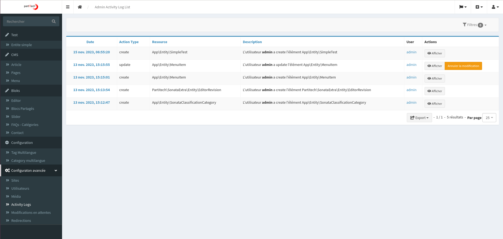
* 
* - Detail view :
* 
* 
* 
* ### Activity Approval
* The SonataExtra Approval Workflow is designed to log all actions within the admin site, providing a comprehensive overview of activities, resources involved, descriptions, and users. This feature ensures that actions are logged but not applied immediately. Instead, they require validation by a user with the `ROLE_APPROVE` permission.
* 
* - **Action Logging**: Logs every action but does not apply changes instantly.
* - **Role-Based Approval**: Actions need approval from a user with `ROLE_APPROVE`.
* - **Pending Modifications Alert**: A red notification badge in the admin interface alerts administrators of modifications awaiting approval.
* - **Detailed Action View**: Displays action type, resource, description, user, and date in the list view.
* - **Approval and Detail Buttons**: Allows administrators to approve modifications or view detailed information.
* - **Purge Functionality**: An option to purge pending modifications.
* - **Detailed Modification View**: Shows impacted fields and values for each action.
* 
* - Documentation : [approval-workflow.md](./approval-workflow.md)
* - Editor action :
* 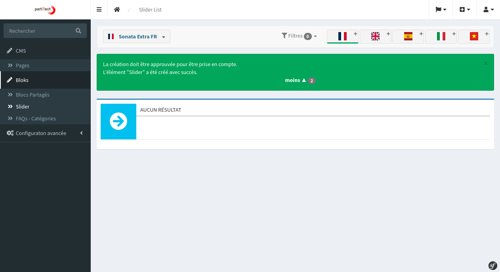
* - Admin notification :
* 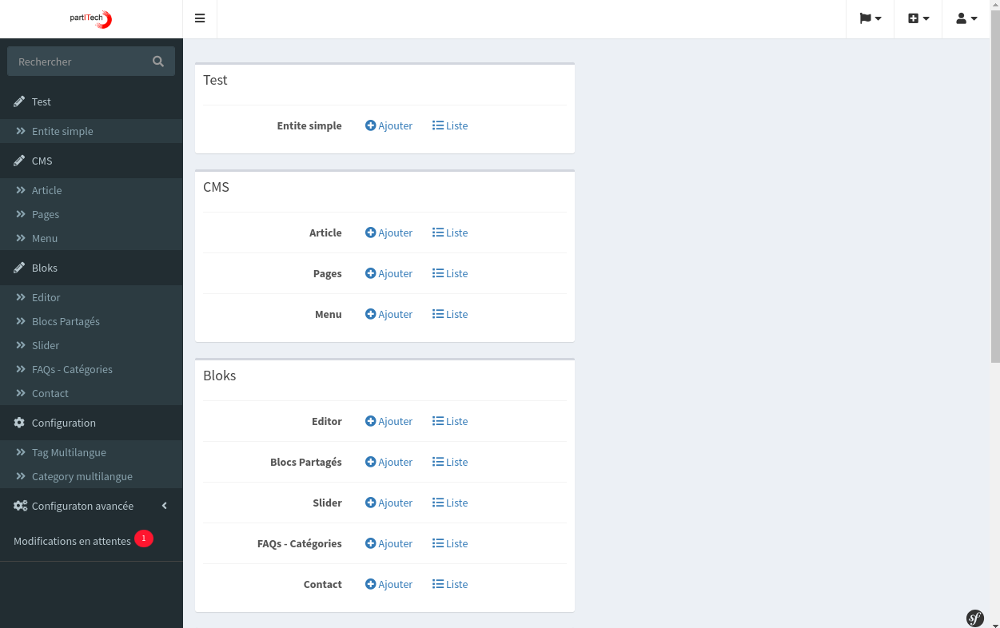
* - List view :
* 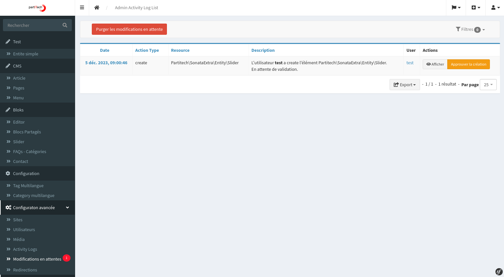
* - Detail view :
* 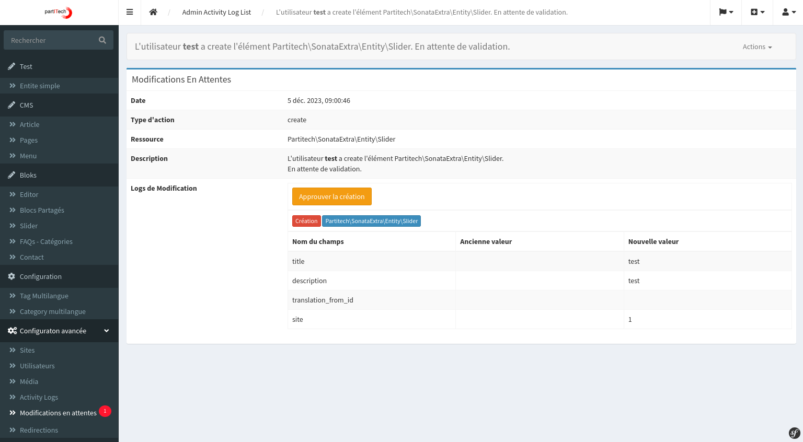
* 
* ### ASSETS MANAGEMENT
* flexible and powerful way to manage CSS and JavaScript assets in Sonata blocks. This feature allows developers to include external CSS and JS files, as well as inline styles and scripts, with ease and efficiency.
* - Documentation : [assets-handler.md](./assets-handler.md)
* ```
* {{ sonata_extra_get_blocks_css('default')|raw }}
* {{ sonata_extra_get_blocks_css_inline('default', true)|raw }}
* {{ sonata_extra_get_blocks_js('default')|raw }}
* {{ sonata_extra_get_blocks_js_inline('default', true)|raw }}
* ```
* ### Blog
* Enhance your Sonata project with the integrated blog feature from Sonata Extra Bundle.
* - Documentation : [blog.md](blog.md)
* - Multilanguage custom urls :
* 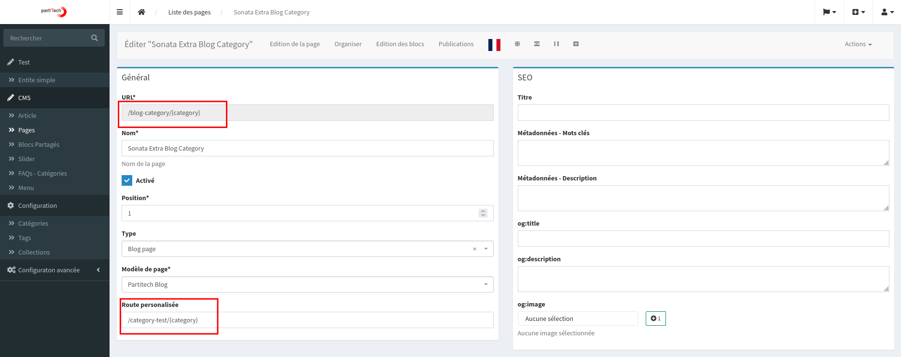
* - Blog service type :
* 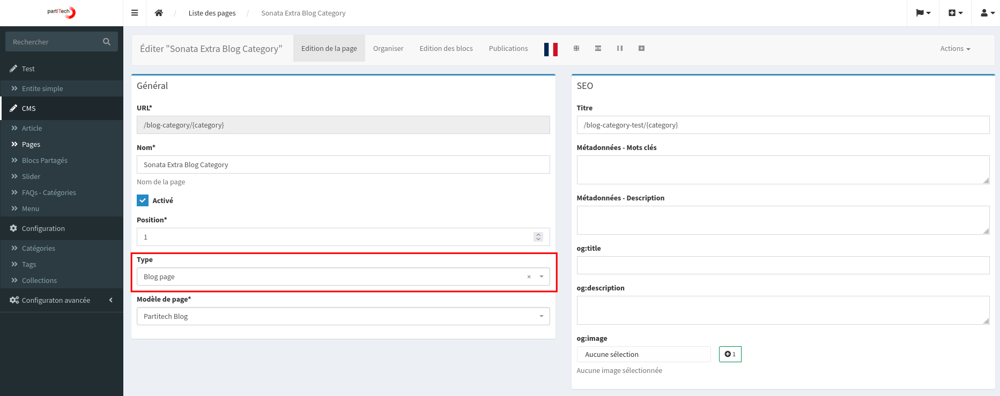
* 
* ### Content Security Policy
* 
* Content Security Policy (CSP) is a crucial security feature in web development, helping to prevent various types of attacks, such as Cross-Site Scripting (XSS) and data injection attacks. The Sonata-Extra bundle for Symfony provides an efficient way to implement and manage CSP in your application.
* - Documentation : [content-security-policy.md](./content-security-policy.md)
* - Code Preview:
* 
* 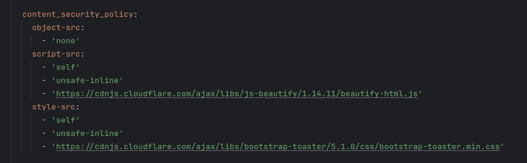
* - Rendered header:
* 
* 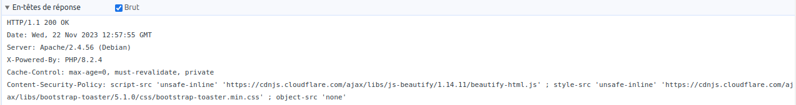
* 
* ### Header Redirect Manager
* Manage all your header redirections
* - Documentation : [header-redirect.md](header-redirect.md)
* - List view :
* 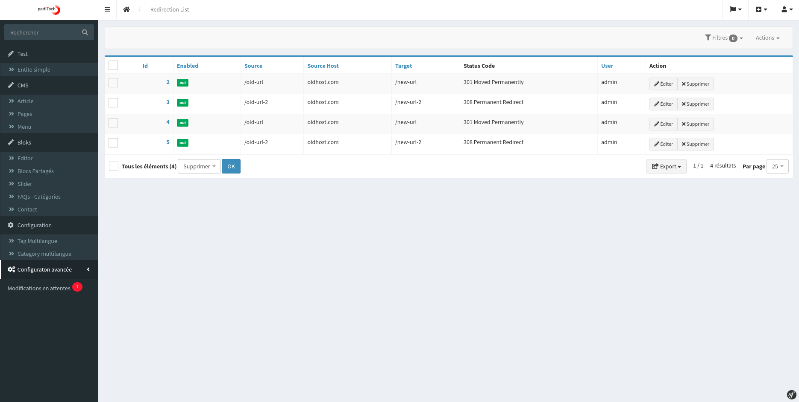
* - Detail view :
* 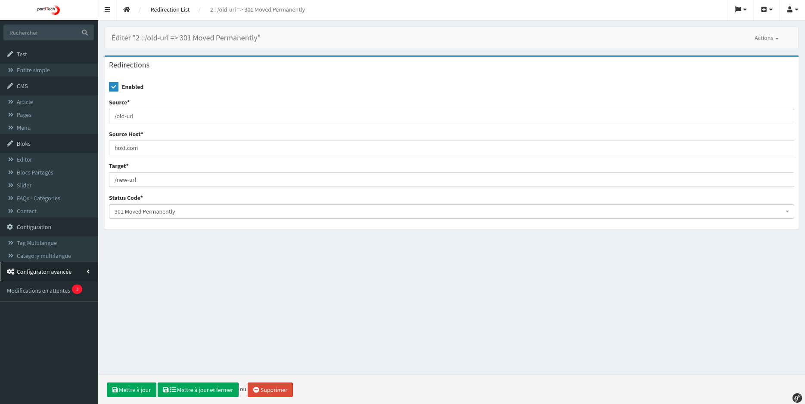
* 
* ### Language-switcher
* The Sonata Extra Bundle provides a feature-rich language switcher compatible with hybrid pages.
* - Documentation : [language-switcher.md](language-switcher.md)
* - Front view :
* 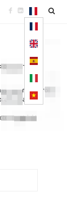
* 
* ### multilang on SonataPageBundle
* The Sonata Extra Bundle enhances the SonataPageBundle by offering comprehensive multisite and multilanguage management capabilities. This feature allows tracking and switching between page translations in the front-end and supports a flexible multisite strategy.
* - Documentation : [multilanguage-support-for-sonata-page.md](multilanguage-support-for-sonata-page.md)
* - List view :
* 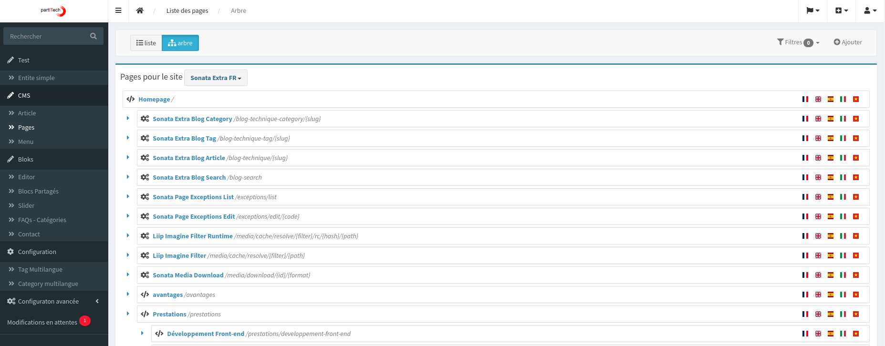
* - Detail view :
* 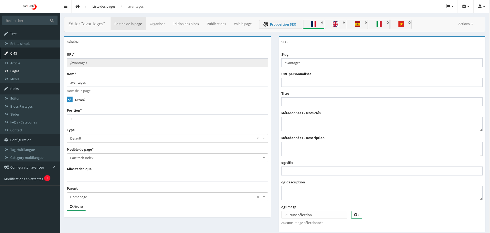
* 
* 
* ### Multilanguage Support for User Admins
* 
* Multilanguage support for admin interfaces. It comprises a trait for admin classes to manage multilanguage interfaces, and a trait for entities to create necessary fields.
* The implementation will add icons for the locales `from sonata_page` sites, enabling linkages with the records and managing all site languages.
* - Documentation : [multilanguage-support-for-users-admins.md](multilanguage-support-for-users-admins.md)
* - List view of the translation in the selected language site
* 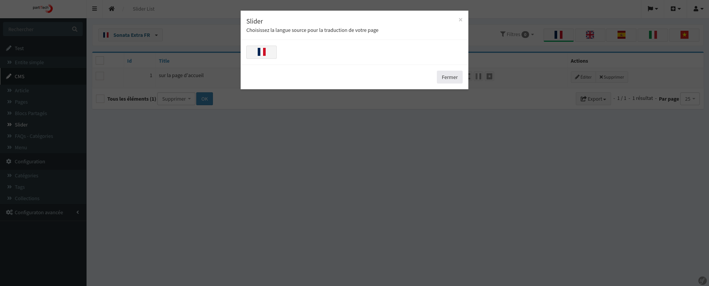
* - Edit view of the translation in the selected language site
* 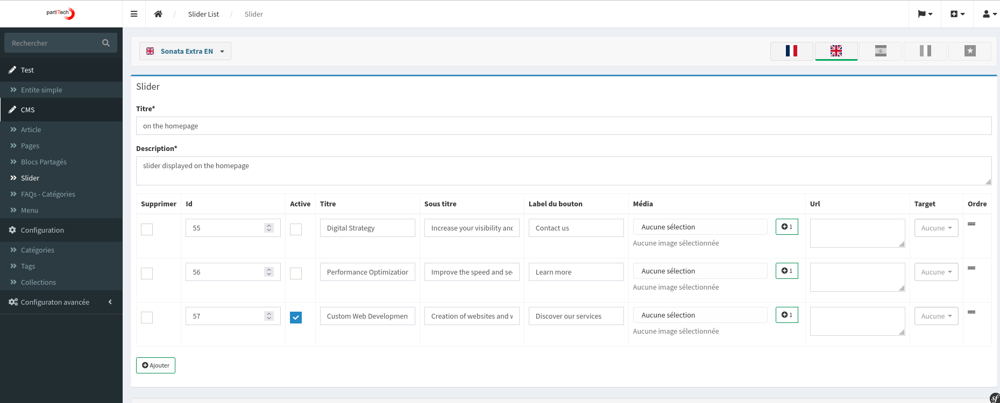
* - Create a tranlsation from a local patern
* 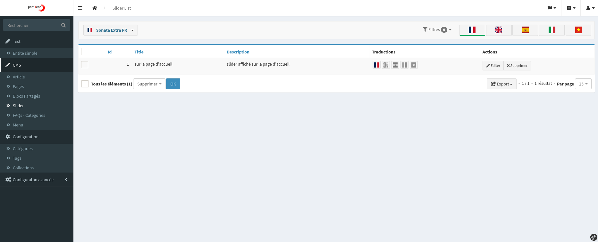
* 
* ### Firewall
* Provides an enhanced set of functionalities for managing firewall rules within the Sonata Admin environment. This bundle allows administrators to create and manage rules for filtering requests based on various criteria like stop words, IP addresses, and User Agents.
* - Documentation : [firewall.md](./firewall.md)
* 
* ### Integration with PrestaSitemapBundle
* Our application automatically integrates with the "PrestaSitemapBundle" to generate a `sitemap.xml` file. This feature encompasses all image assets, article modules, and content pages within the application. The process is entirely automated and includes support for multilingual links.
* - Documentation : [sitemap.md](./sitemap.md)
* 
* ## Smart services (AI-powered services)
* ### Translation
* The Sonata Extra Bundle provides a powerful feature for automatic translation through its [Smart service](smart-service.md) functionality. This feature allows users to effortlessly translate text between different languages using AI-powered translation providers.
* - Documentation : [smart-service.md](./smart-service.md)
* ### Translation CMD
* A command to automate the translation of a selected language for an admin object.
* - Documentation : [translation-cmd.md](./translation-cmd.md)
* ### Translation template
* - Documentation : [translation-cmd-create-template.md](./translation-cmd-create-template.md)
* 
* ## WORDPRESS-IMPORT
* The sonata-extra:wordpress-importer command is designed for importing images, categories, posts, and tags from a WordPress site into your application. This command is key for integrating WordPress content with ease.
* - Documentation : [wordPress-import.md](./wordPress-import.md)
* - Import cmd :
* 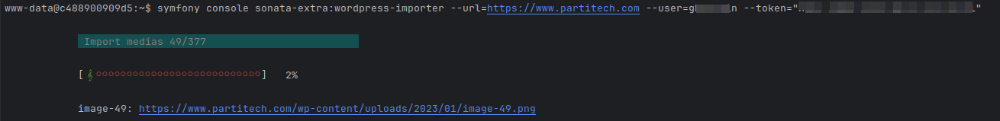
* 
* ## Blocks
* ### Cookie Consent Block (GDPR)
* The Cookie Consent Block is a customizable solution integrated into the Sonata Extra Bundle to manage user consent for cookies in compliance with GDPR regulations. It offers a flexible and user-friendly interface for cookie consent management.
* - Documentation : [cookie-consent-block.md](./cookie-consent-block.md)
* 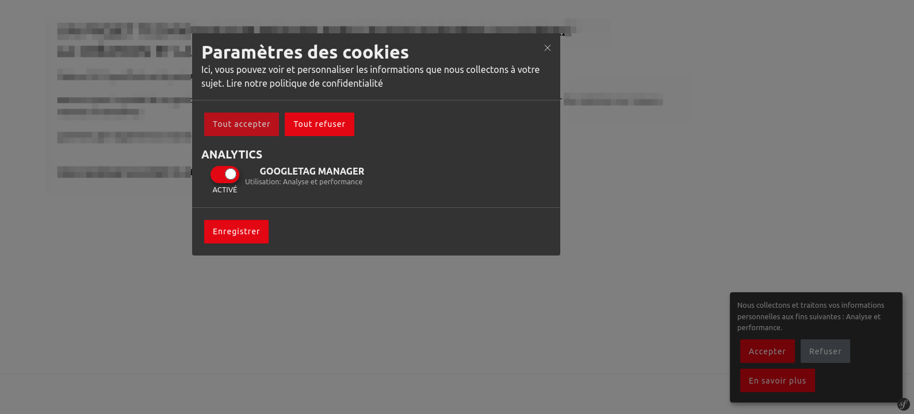
* 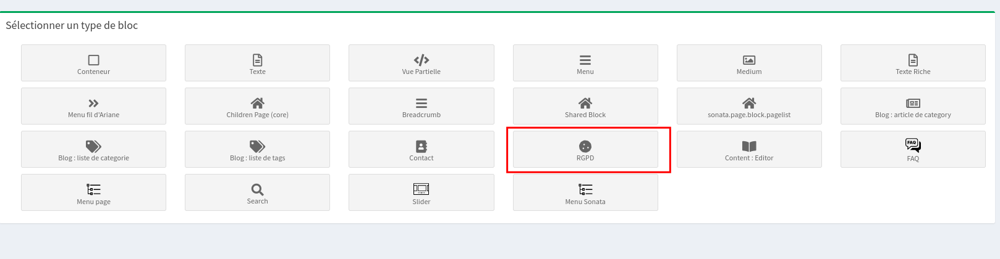
* 
* ## Form types
* ### GUTENBERG EDITOR
* Integrating the Gutenberg editor into Sonata involves using the 'Automatic Isolated block editor' library. This guide details the steps needed to install and configure the Gutenberg editor in your Sonata application.
* - Documentation : [form-type-gutenberg.md](./form-type-gutenberg.md)
* 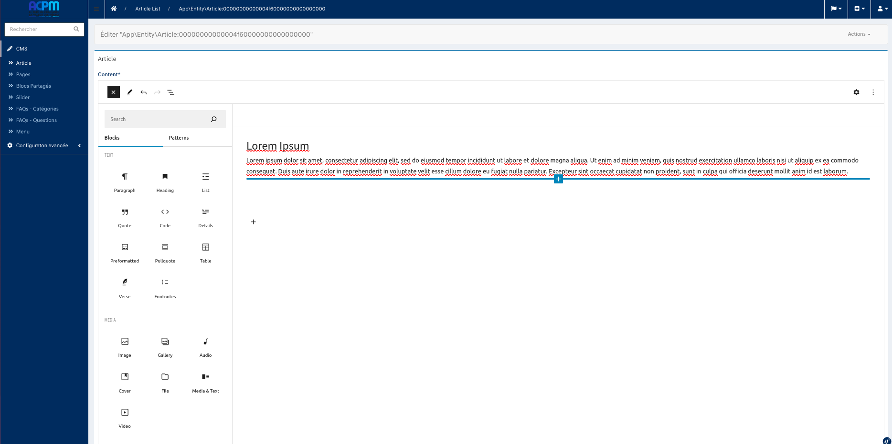
* 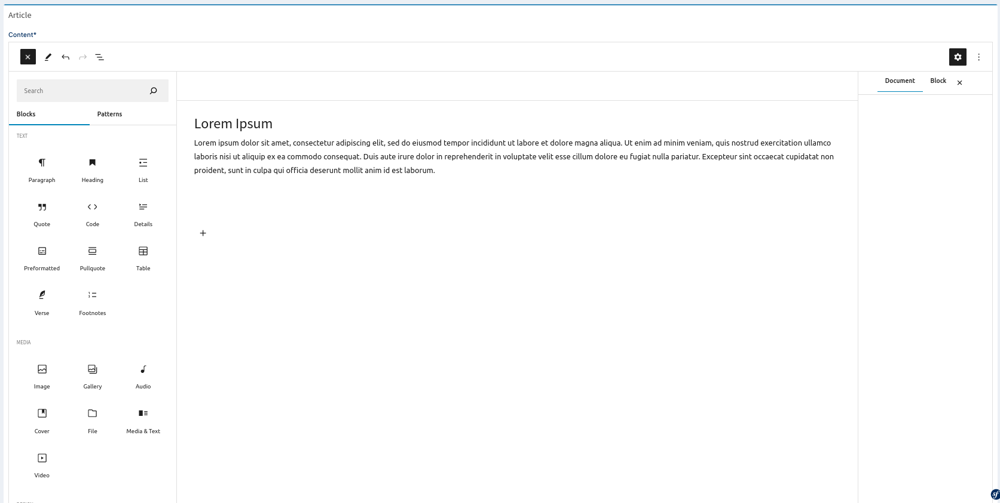
* 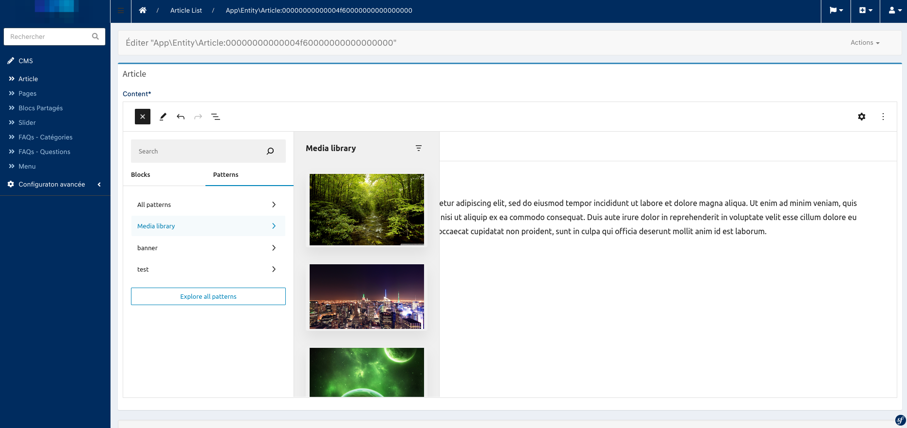
* 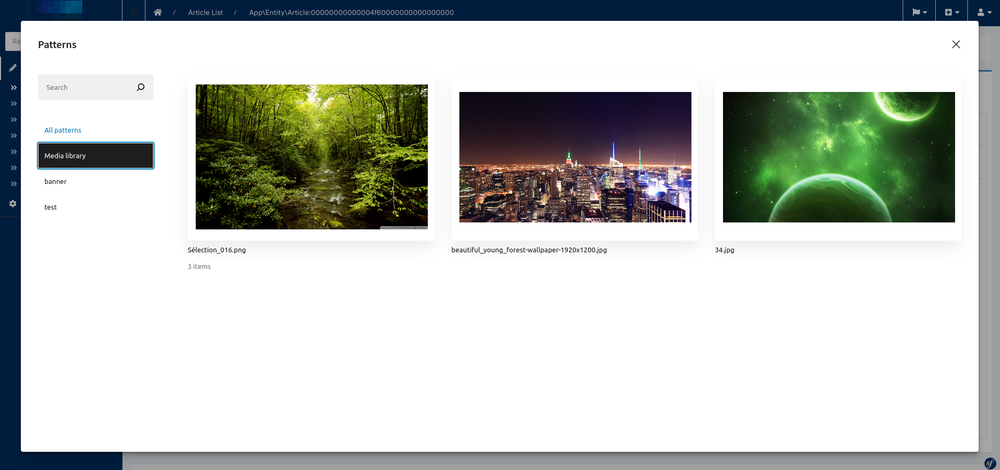
* 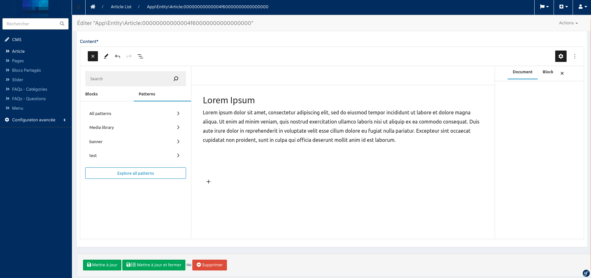
* 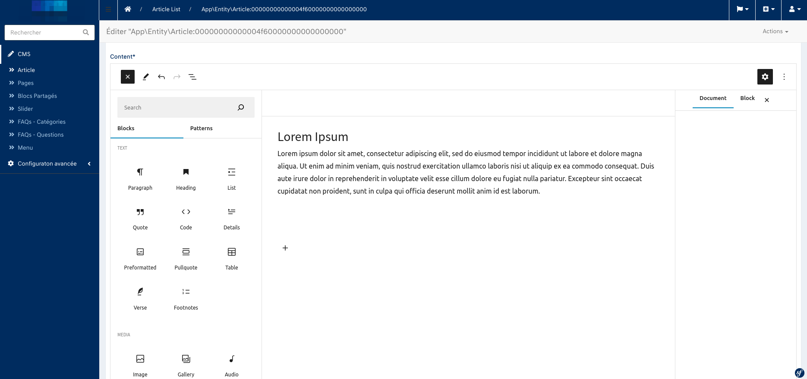
* 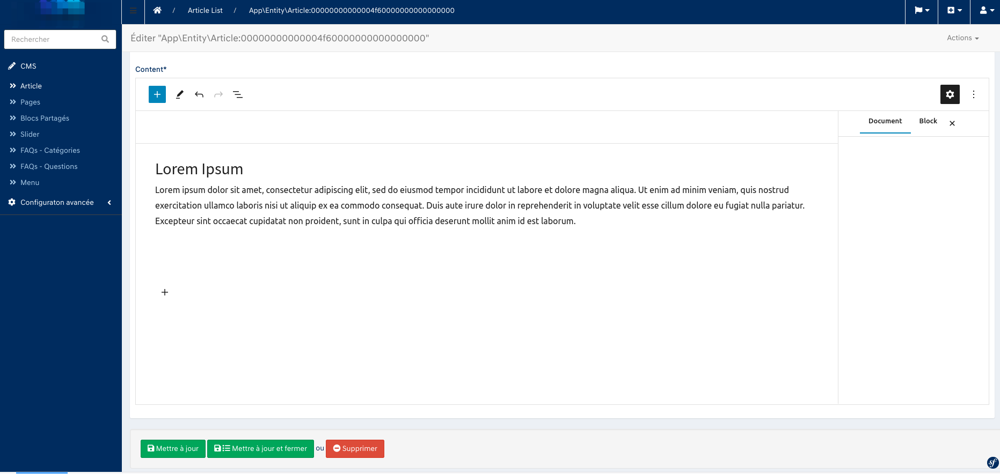
* 
* ### Slider Manager with Sonata Page Block
* - **Preview**: 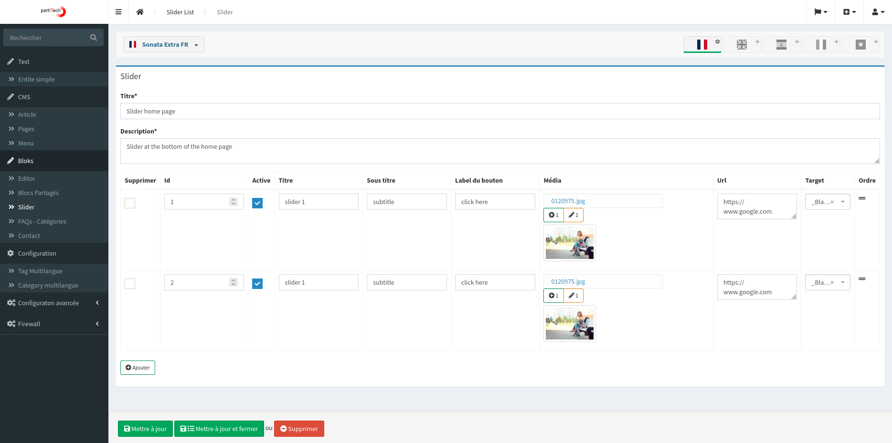
* - Add sliders to Sonata Page with customizable blocks
* 
* ### FAQ Manager with Sonata Page Block
* - Easily integrate FAQs into your Sonata Pages
* - **FAQ list**: 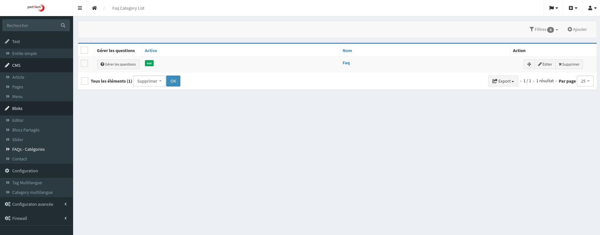
* - **Questions**: 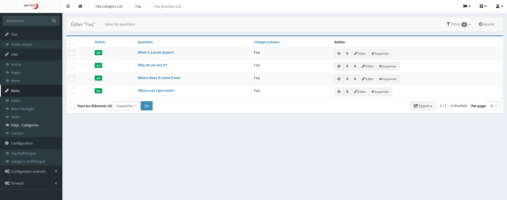
* - **Block**: 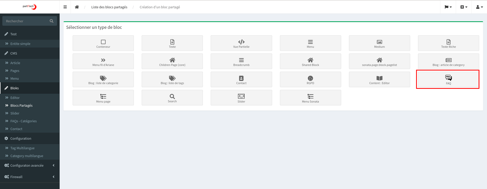
* - **Page edition**: 
* 
* 
* 
* 
* ### Sonata Page Block Manager
* - Hide undesired blocks in Sonata Page block manager
* - **Preview**: 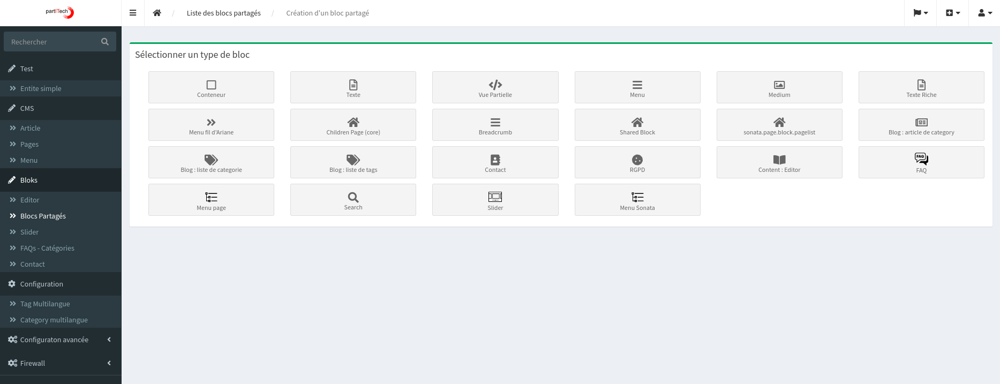
* 
* 
* ### Article Manager with Gutenberg Editor
* - Write articles using the Gutenberg editor
* - **Gutemberg editor**: 
* - **Editor selector**: 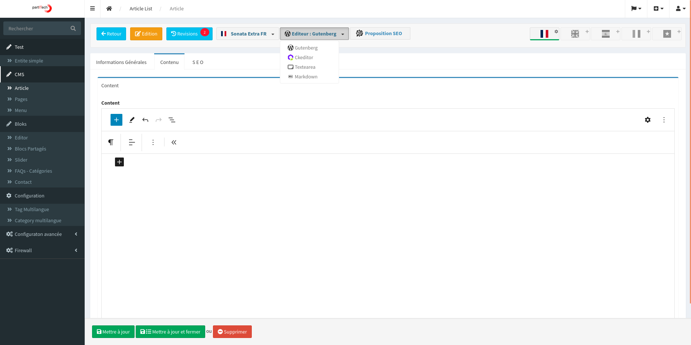
* 
* 
* ### Sonata Admin FormTypes
* - Additional FormTypes for Sonata Admin
* - **Gutemberg Editor**: 
* - **Markdown editor**: 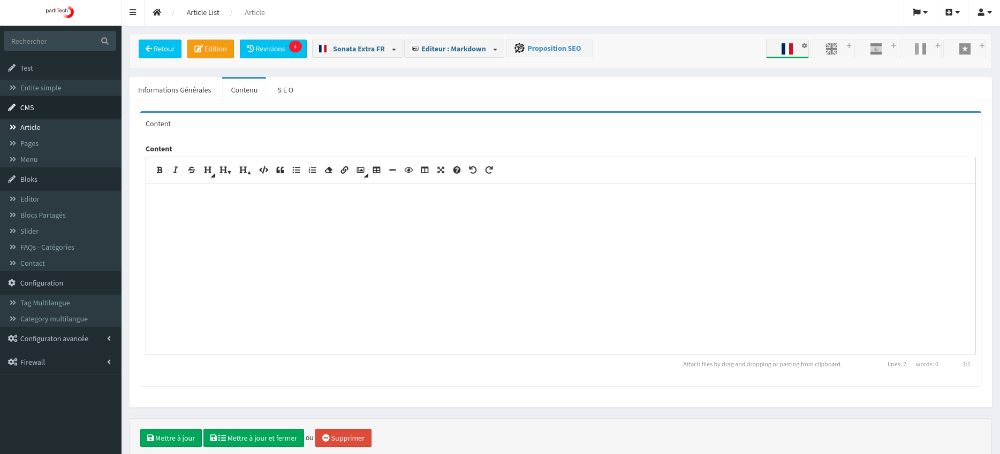
* 
* ### Gutenberg Editor with Advanced Features
* - WordPress's Gutenberg editor with file upload, custom patterns, and SonataMedia gallery
* - Editor view :
* - Blocks selection : 
* - Patterns selection : 
* - Media library : 
* - Media library expended view: 
* 
* 
* 
* ### CKEditor Gallery View
* 
* - View galleries in CKEditor with improved UI
* - Select media  :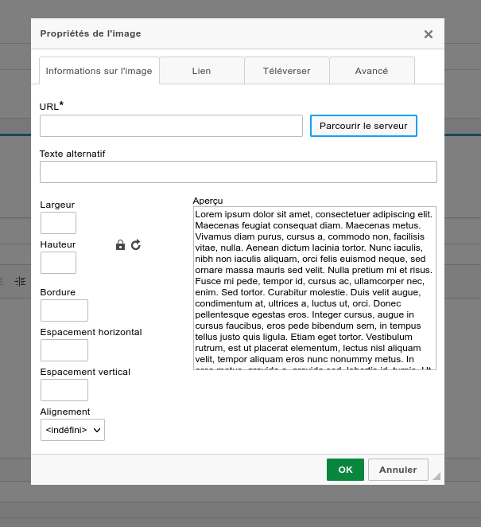
* - Media brwoser window : 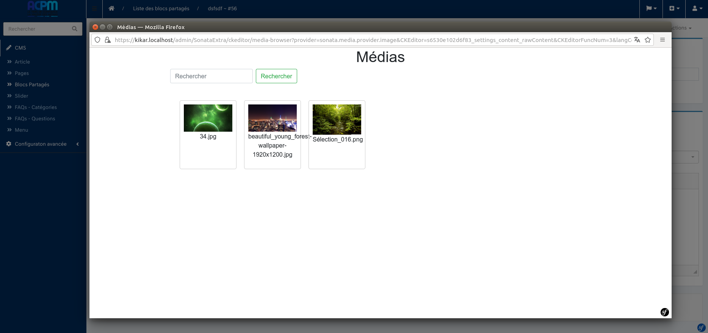
* - **Preview**: 
* 
* ### Automatic WordPress Importer
* - **Code Preview**: 
* - documentation : [wordPress_import.md](WordPress_import.md)
* 
* 
* 
* ---