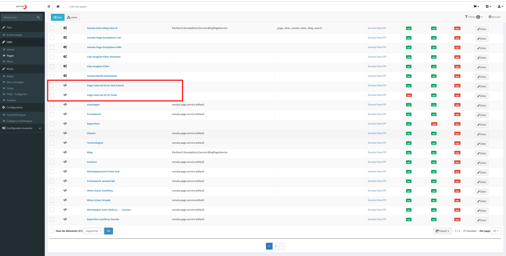
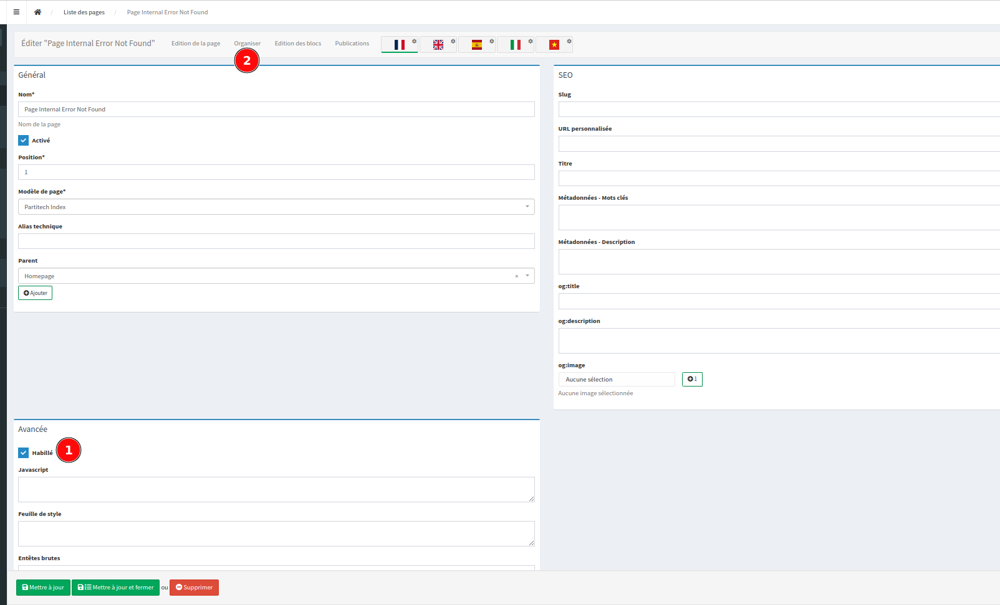
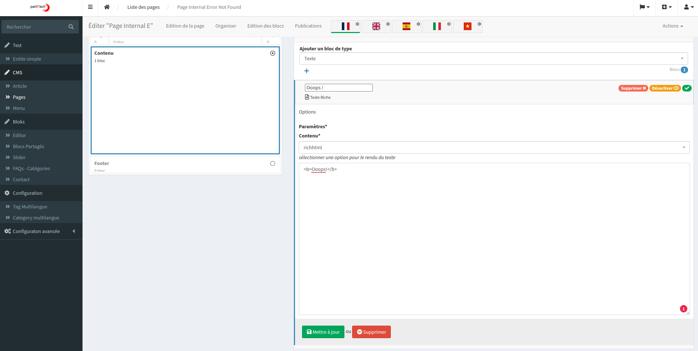
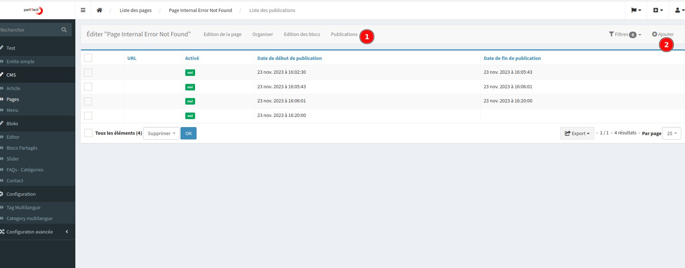

# Configuring Custom 404 and 500 Error

Customizing error pages (404 - Not Found and 500 - Internal Server Error) in your application can enhance user experience during unexpected situations. This guide will walk you through the process of setting up custom error pages in the SonataExtraBundle.

## Prerequisites

Before proceeding, there are a few important things to note:

- **Development Environment**: Custom error pages are not displayed in the development environment. To see them in action, you need to set your application to production mode.
- **Environment Settings**: Change your `.env` file settings to `APP_ENV=prod` and `APP_DEBUG=0`.
- **Admin Session**: Ensure you are not logged in as an admin. It's recommended to use one session for admin and another (in private browsing) to test the error pages.


## Update SonataPage Configuration

Firstly, add the following to your SonataPage configuration file:

```
sonata_admin:
    catch_exceptions:
        not_found: [404]
        fatal:     [500]

```

This configuration enables SonataPage to trigger an Exception listener and forward the response to `_page_internal_error_{key}` route. SonataPage intelligently links this to a designated page.


## Decorate Error Pages
In the Sonata "Pages" admin panel, locate and check the "decorate" checkbox.



You'll see Page Internal Error Fatal and Page Internal Error Not Found options, which are crucial for the next steps.

## Translation and Customization
All elements of the error pages are translatable, offering flexibility in different locales.



After selecting "habillé" (decorate), save your changes and proceed to the “organize” pane. Here, you can customize the main container of your error page.



## Publishing the Custom Pages

The final step involves publishing your customized pages. 
Create a snapshot of your page by clicking on the publication pane.




Conclusion
After completing these steps, your custom 404 and 500 error pages should be live and visible in production mode.


With this setup, you ensure a better user experience even during error situations in your application.


