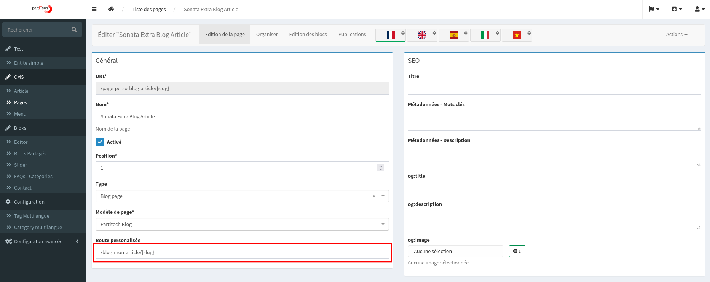
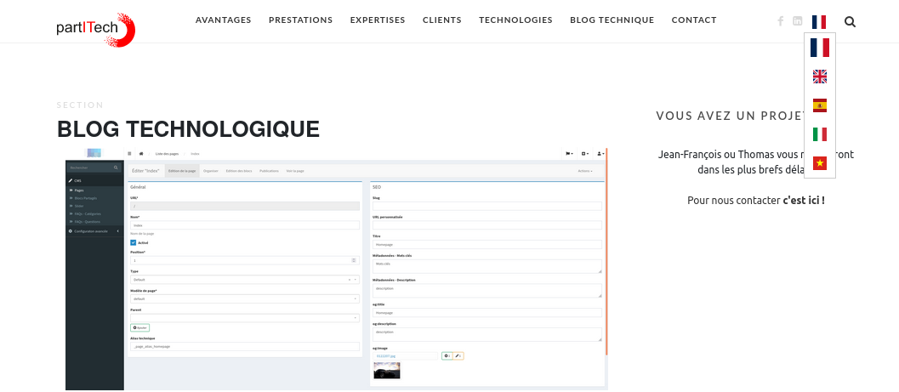

# Language Switcher and Localized Hybrid Pages


The Sonata Extra Bundle provides a feature-rich language switcher compatible with hybrid pages. This document outlines the steps to enable and utilize the language switcher in your Sonata application.

## Integration with Hybrid Pages

The language switcher can seamlessly integrate with your existing controllers and routes. Once you have a controller with a defined route, you can find and manage it in the Sonata page manager. The Sonata Extra Bundle allows customization of action URLs.

Example:
- French version of a blog article page: `/blog-mon-article/{slug}`

- English version of the same page: `/blog-my-article/{slug}`


The language switcher automatically detects localized pages based on the setup.


## Injecting Locale Service

To enable the language switching functionality, inject the LocaleService into your application:

```php

 use Partitech\SonataExtra\Service\LocaleService;
 
```
Use the service to inject the calculated localized route into the request object:
```php

$linkHeader = $this->localeService->languageSelectorGetHeaderLinks($tagEntity, 'sonata_extra_blog_tag');
$response->headers->set('Link', $linkHeader);

```

The request object is then utilized in the language switcher block to render the dropdown for language selection.


## Entity Treatment and Route Association

The core functionality lies in the treatment of entities. Each time you manipulate an entity, the process checks for localized linked items. To enable this, inform the entity about the associated routes:

Example:
```php
class SonataClassificationCategory extends BaseCategory
{
use EntityTranslationTrait;

    private array $baseRouteName = [
        'sonata_extra_blog_category',
        'sonata_extra_blog_search'
    ];
    // ...
}
```

The process can handle various types of route configurations. Set an argument with a corresponding getter to facilitate this.

Example:
For a route like `/blog-category/{slug}`, the process utilizes the `$entity->getSlug()` function to pass it to the URL generator.

