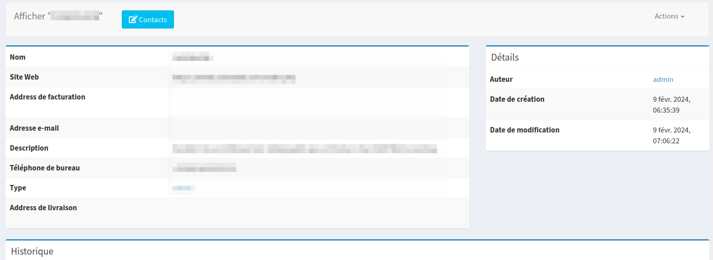
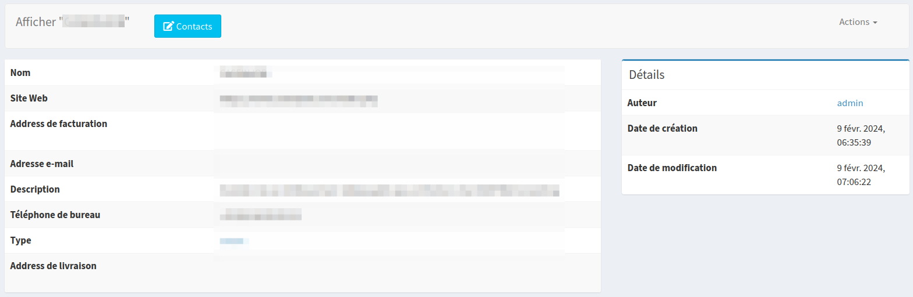
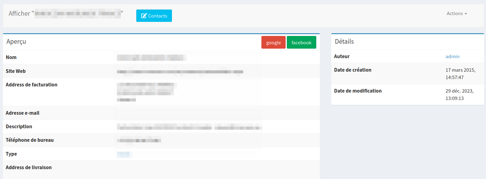
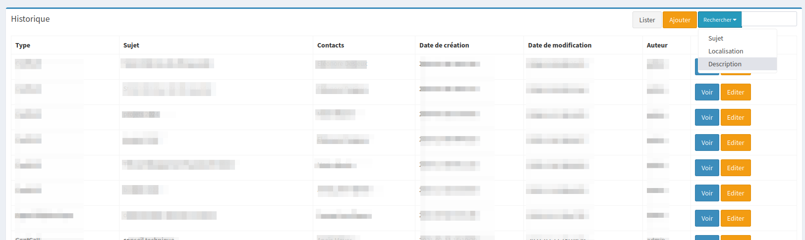
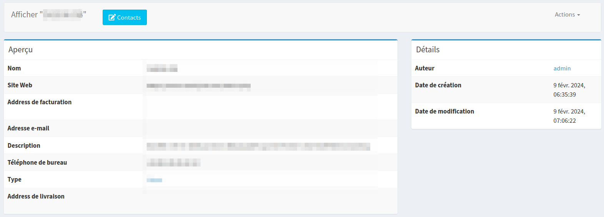
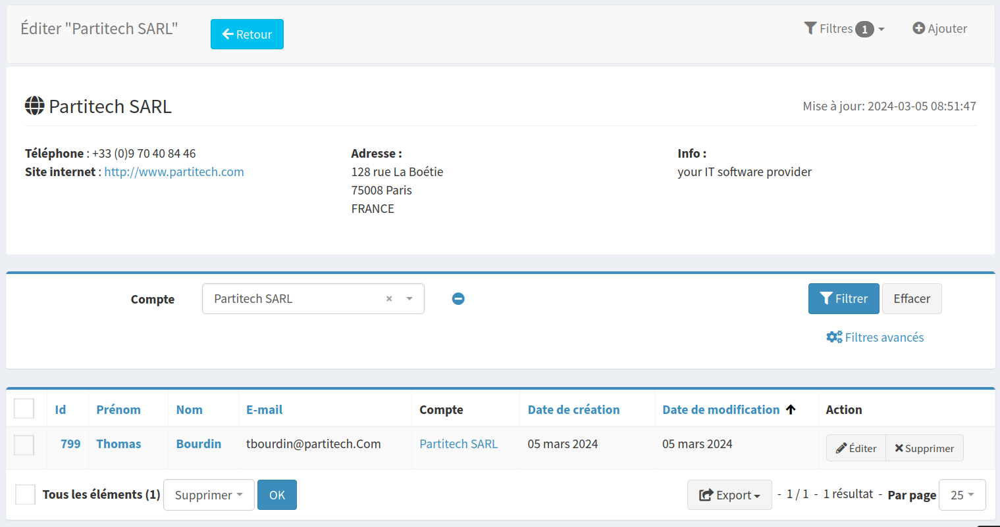
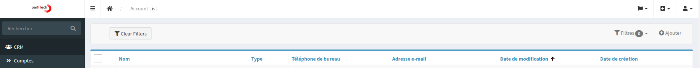

# Sonata Extra Bundle: CRUD Customization Features

The Sonata Extra Bundle provides a powerful feature for customizing the CRUD interface.

## Configuration of Show and Edit Views

### Customizing Block Titles and Borders

It is now possible to configure the visibility of block titles and their borders in the `show` and `edit` views. Additionally, users can add custom buttons to the title bar on the right side, and a search list.

#### Implementation

To utilize this feature, override the templates for each view in your admin class as follows:

```php
class MyAdmin extends AbstractAdmin
{
    public function configure(): void
    {
        $this->setTemplates([
            'edit' => '@PartitechSonataExtra/Admin/CRUD/edit.html.twig',
            'list' => '@PartitechSonataExtra/Admin/CRUD/list.html.twig',
            'show' => '@PartitechSonataExtra/Admin/CRUD/show.html.twig',
        ]);
    }
}
```

#### Field Group Configuration

When configuring field groups, use the following syntax to configure the title of the box:

- Hidding the title :



- Hidding the title and the border :



- Add some buttons in the title :



```php
->with('block1', [
    'class' => 'col-md-8',
    'label' => 'first block',
    'show_header' => true, // true|false
    'show_header_border' => true, // true|false
    'header_btn' => [
        [
            'url' => '//www.google.com',
            'target' => '_blank',
            'class' => 'btn-danger', // Options: btn-default, btn-primary, btn-danger, etc.
            'label' => 'Google',
            'icon' => 'fa-plus-circle',
        ],
        [
            'url' => '//www.facebook.com',
            'target' => '_blank',
            'class' => 'btn-success',
            'label' => 'Facebook',
            'icon' => 'fa-plus-circle',
            'confirm'=>'Are you sure ?' // optionnal parameter to invoke modal data-confirm
        ],
    ],
])
```
You can also add a search list box. This search area can be configured to include a list of searchable links, enhancing user interaction and data navigation.

- Add search list box in the title :



```php
$url_note_list = $admin->generateUrl('Partitech\SonataCrm\Admin\NoteAdmin.list', ['id' => $id]);

$showMapper->with('block_notes', [
    'class' => 'col-md-12',
    'label' => 'sonata-crm.account.block_notes',
    'search_list' => [
        'label' => 'Rechercher',
        'class' => 'btn-info', // Options: btn-default, btn-primary, btn-danger, etc.
        'icon' => 'fa-search',
        'list' => [
            [
                'url' => $url_note_list . '?filter[subject][value]=',
                'target' => '_self',
                'class' => '',
                'label' => 'sonata-crm.note.subject'
            ],
            [
                'url' => $url_note_list . '?filter[location][value]=',
                'target' => '_self',
                'class' => '',
                'label' => 'sonata-crm.note.location'
            ],
            [
                'url' => $url_note_list . '?filter[description][value]=',
                'target' => '_self',
                'class' => '',
                'label' => 'sonata-crm.note.description'
            ]
        ]
    ]
]);

```

The search input's content is dynamically appended to the URL as the user types. For instance, if the search query is "abcd", the resultant URL for searching by subject would be:

```php
$url_note_list . '?filter[subject][value]=abcd'
```
This corresponds to the GET parameters used by Sonata's CRUD filtering system. For the search feature to function correctly for a field, the corresponding CRUD filter must exist.

#### Customizing Navigation Bar Button Classes

Enhance the visual appeal of your navigation bar buttons by adding custom classes and icons.

- Tab button :



```php
protected function configureTabMenu(MenuItemInterface $menu, string $action, AdminInterface $childAdmin = null): void
{
    if (!$childAdmin && !in_array($action, ['edit', 'show'])) {
        return;
    }

    $admin = $this->isChild() ? $this->getParent() : $this;
    $id = $admin->getRequest()->get('id');

    if (!$childAdmin && in_array($action, ['edit', 'show'])) {
        $contacts = $menu->addChild('Contacts', $admin->generateMenuUrl(current($this->getChildren())->getCode().'.list', ['id' => $id]));
        $contacts->setExtras([
            'btn_class' => ('edit' === $action) ? 'btn-warning' : 'btn-info',
            'btn_icon' => 'fa-edit',
        ]);
    }
}
```

By configuring the setExtras method, users can specify the button class and icon, enhancing the UI/UX of the admin panel.


#### Customizing field to show HTML
When form CKeditor or any other WYSIWYG editor, the view will need to display the raw HTML.
You can use the following template in your 

```php
protected function configureShowFields(ShowMapper $showMapper): void
    {
        $showMapper
            ->add('ckeditor_field',null,[
                'label'=>'Field that display HTML',
                'template' => '@PartitechSonataExtra/Admin/CRUD/show_field_html.html.twig',

            ])

    }
}
```

#### Append or prepend template to the page content header
You can add any template before or after the content header. For example, on a nested interface, we can display parent info in list, edit or show view.

- Content header display :



- Templates names :
  - `show_prepend_page_content_header_template`
  - `list_prepend_page_content_header_template`
  - `edit_prepend_page_content_header_template`
  - `show_append_page_content_header_template`
  - `list_append_page_content_header_template`
  - `edit_append_page_content_header_template`

Example from Partitech/sonata-crm
 - Add template path into the admin class:
```php
class YourAdmin extends AbstractAdmin
{
    public function configure(): void
    {
        $this->setTemplates([
            'edit' => '@PartitechSonataExtra/Admin/CRUD/edit.html.twig',
            'list' => '@PartitechSonataExtra/Admin/CRUD/list.html.twig',
            'show' => '@PartitechSonataExtra/Admin/CRUD/show.html.twig',
            'show_append_page_content_header_template' => '@PartitechSonataCrm/Account/extra_header.html.twig',
            'list_append_page_content_header_template' => '@PartitechSonataCrm/Account/extra_header.html.twig',
            'edit_append_page_content_header_template' => '@PartitechSonataCrm/Account/extra_header.html.twig',
        ]);

    }
}
```

- Twig template could look like bellow :
```twig


    
        
        
            
        
    



<section class="invoice" style="margin: 3px 0px;border-radius: 4px;">

    <div class="row">
        <div class="col-xs-12">
            <h2 class="page-header">
                <i class="fa fa-globe"></i> {{ object.name }}
                <small class="pull-right">Mise à jour: {{ object.dateModified|date('Y-m-d H:i:s') }}</small>
            </h2>
        </div>

    </div>

    <div class="row invoice-info">


        <div class="col-sm-4 invoice-col">

            <address>
                <b>Téléphone</b> : {{ object.officePhone }}<br>
                <b>Site internet</b> : <a href="{{ object.website }}" target="_blank">{{ object.website }}</a><br>
            </address>
        </div>

        <div class="col-sm-4 invoice-col">
            <b>Adresse :</b><br>
            <address>
                {{ object.billingAddressStreet }}<br>
                {{ object.billingAddressPostalcode }} {{ object.billingAddressCity }} {{ object.billingAddressState }}<br>
                {{ object.billingAddressCountry }}
            </address>
        </div>

        <div class="col-sm-4 invoice-col">
            <b>Info :</b><br>
            {{ object.description|raw }}
        </div>
    </div>
</section>


```


### Activate the preserve filter option

Once the list view is overriden in your admin, you can activate the preserve filters option.

This will keep in session your current list layout for each CRUD list. A button to reset your filters wil bee displayed in the top navigation bar.




- Override the list template
```
    public function configure(): void
    {
        $this->setTemplates([
            'list' => '@PartitechSonataExtra/Admin/CRUD/list.html.twig',
         ]);

    }
```

- Activate the preserve filter option 
```
class YourAdmin extends AbstractAdmin
{
    var $preserveFilters = true;
}
```
